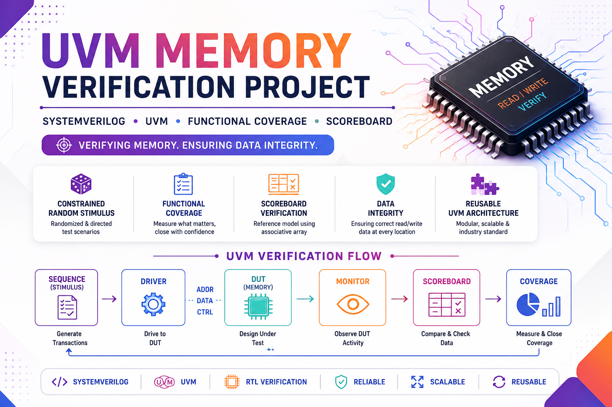

# 🚀 UVM Memory Verification Project



## 📌 Project Overview

This project demonstrates the verification of a synchronous memory using the Universal Verification Methodology (UVM).

The verification environment is designed using reusable UVM components and verifies memory read/write functionality through constrained-random stimulus generation, functional coverage collection, and scoreboard-based data checking.

The project follows industry-standard verification practices and can be extended for larger memory subsystems.

---

## 🎯 Verification Objectives

✅ Verify Memory Write Operations

✅ Verify Memory Read Operations

✅ Verify Multiple Read/Write Transactions

✅ Verify Complete Memory Address Space

✅ Ensure Data Integrity

✅ Collect Functional Coverage

✅ Detect Data Mismatches using Scoreboard

---

## 🏗️ UVM Testbench Architecture

```text
                    +----------------+
                    |     TEST       |
                    +-------+--------+
                            |
                            v
                    +----------------+
                    |      ENV       |
                    +-------+--------+
                            |
              +-------------+-------------+
              |                           |
              v                           v
      +---------------+         +----------------+
      |     AGENT     |         |   SCOREBOARD   |
      +-------+-------+         +----------------+
              |
    +---------+---------+
    |                   |
    v                   v
+--------+         +---------+
| DRIVER |         | MONITOR |
+----+---+         +----+----+
     |                  |
     v                  |
+---------+             |
|  DUT    | <-----------+
+---------+

```

---

## 📂 Project Structure

```text
MEMORY_UVM/
│
├── memory.v               # DUT
├── mem_intf.sv            # Interface
│
├── mem_tx.sv              # Transaction Class
├── mem_drv.sv             # Driver
├── mem_mon.sv             # Monitor
├── mem_sqr.sv             # Sequencer
├── mem_agent.sv           # Agent
│
├── mem_env.sv             # Environment
├── mem_sbd.sv             # Scoreboard
├── mem_cov.sv             # Functional Coverage
│
├── seq_lib.sv             # Sequences
├── test_lib.sv            # Test Cases
│
├── mem_common.sv          # Common Definitions
├── top.sv                 # Top Module
│
├── run.do                 # Simulation Script
└── list.svh               # File List
```

---

## 🧩 UVM Components

### 📦 Transaction

Represents memory transactions containing:

- Address
- Write Data
- Read Data
- Read/Write Control

---

### 🚗 Driver

Converts sequence items into DUT pin-level activity.

Responsibilities:

- Drives interface signals
- Applies transactions
- Synchronizes with DUT clock

---

### 👀 Monitor

Passively observes DUT activity.

Responsibilities:

- Captures transactions
- Broadcasts through Analysis Port

---

### 🎛️ Sequencer

Controls transaction flow between sequence and driver.

---

### 🏢 Agent

Groups:

- Driver
- Monitor
- Sequencer

into a reusable verification block.

---

### 📊 Scoreboard

Reference model implemented using an Associative Array.

Features:

- Stores expected write data
- Compares actual read data
- Tracks matches and mismatches

---

### 📈 Functional Coverage

Coverage Points:

- Read/Write Operations
- Memory Addresses

Cross Coverage:

- Operation × Address

```systemverilog
WR_RD_CP
ADDR_CP
WR_RD_X_ADDR
```

---

## 🧪 Implemented Test Scenarios

### 1️⃣ Single Write Single Read

- Perform one write transaction
- Read back same location
- Compare data

---

### 2️⃣ Multiple Write Multiple Read

- Randomized transactions
- Data integrity checking

---

### 3️⃣ Full Memory Verification

- Access entire memory depth
- Unique address generation
- Full address coverage

---

## 📊 Coverage Strategy

Coverage is collected for:

| Coverage Item | Purpose |
|--------------|----------|
| Write Operation | Verify write transactions |
| Read Operation | Verify read transactions |
| Address Coverage | Verify all locations |
| Cross Coverage | Verify all operation-address combinations |

---

## 🔍 Scoreboard Checking

Expected values are stored using an Associative Array:

```systemverilog
sbd_AA[tx.addr] = tx.wr_data;
```

Read transactions are compared against expected values.

```systemverilog
if(tx.rd_data == sbd_AA[tx.addr])
```

---

## 🛠️ Tools Used

- SystemVerilog
- UVM
- ModelSim / QuestaSim

---

## 🌟 Key Verification Features

✅ Constrained Random Verification

✅ Functional Coverage

✅ Cross Coverage

✅ Scoreboard Validation

✅ Reusable UVM Architecture

✅ Analysis Port Communication

✅ Config DB Usage

✅ Multiple Test Scenarios

---

## 📚 Learning Outcomes

This project demonstrates practical experience with:

- UVM Components
- Sequence Development
- Driver/Monitor Design
- Functional Coverage
- Scoreboards
- Analysis Ports
- Verification Planning
- Coverage Closure Concepts

---

## 👨‍💻 Author

**Rakesh Magapu**

VLSI Design & Verification Engineer

SystemVerilog | UVM | RTL Design | Functional Verification
